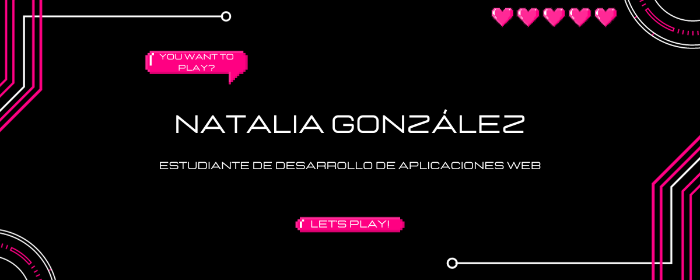
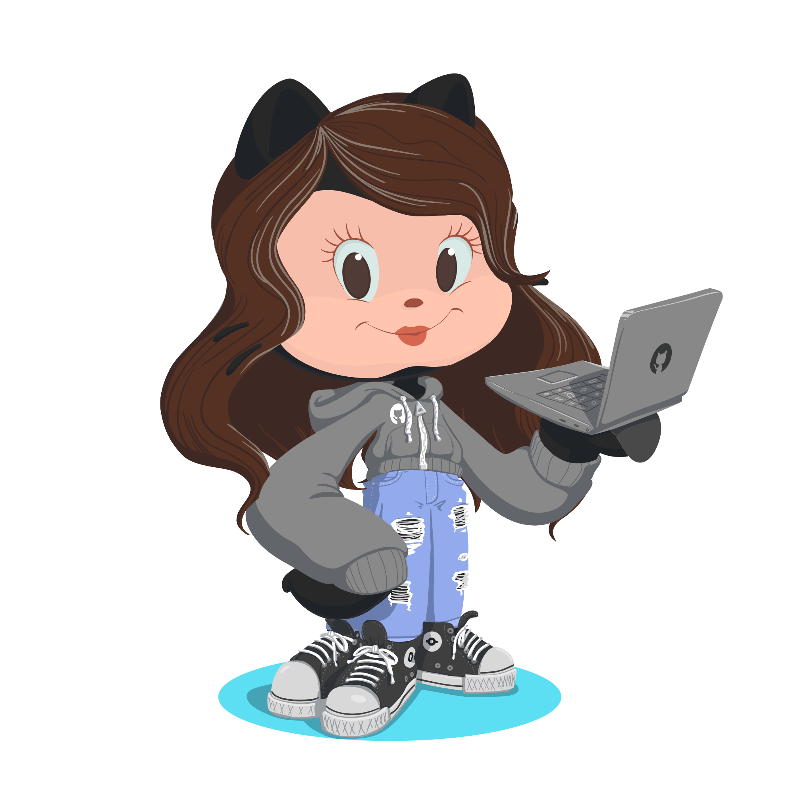

<h1>¡¡Hola, soy Natalia González!!☀️</h1>

¡Hola! Soy Natalia, una estudiante apasionada de desarrollo de aplicaciones web. Me encanta sumergirme en el mundo de la tecnología y utilizar mis habilidades para crear experiencias interactivas en línea.

Además de mi interés por el desarrollo web, soy una gran fanática de los videojuegos. Desde que era pequeña, los videojuegos han sido una parte importante de mi vida. Me encanta la emoción y la creatividad que se encuentran en los juegos, así como la forma en que pueden transportarnos a mundos virtuales llenos de aventuras.

Otra de mis grandes pasiones es la música. Disfruto de diferentes géneros y artistas, y encuentro en la música una forma de expresión y conexión emocional. Me fascina cómo la tecnología ha transformado la industria musical, permitiendo una mayor accesibilidad y nuevas formas de crear y compartir música.

Como estudiante de desarrollo de aplicaciones web, estoy emocionada por combinar mis intereses en los videojuegos, la música y la tecnología. Me encantaría explorar la creación de aplicaciones web interactivas relacionadas con la música y los videojuegos, y utilizar mi conocimiento para brindar experiencias únicas y atractivas a los usuarios.
